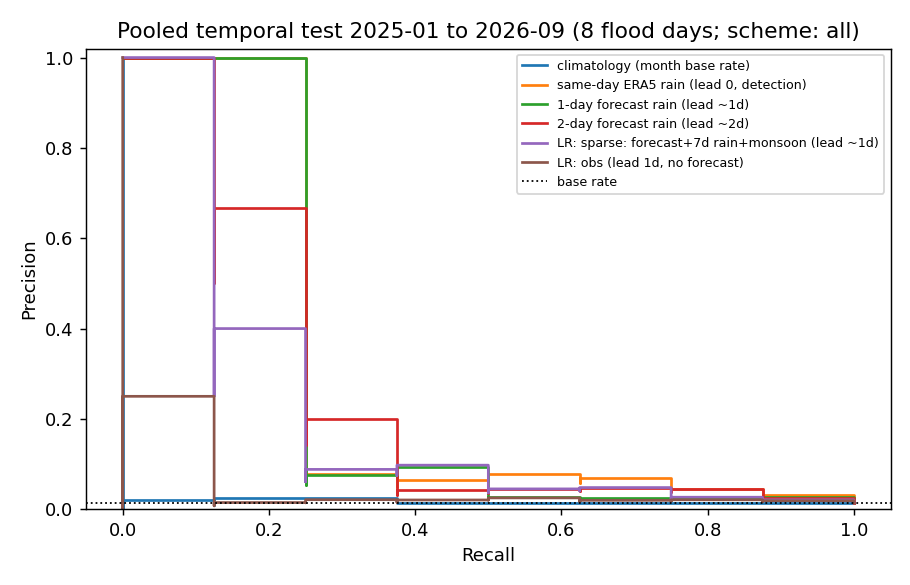

# Can we build a flood early-warning model from 2024-2026 alone?

**Answer: there is a detectable rain-driven signal, but not a meaningful (validated, usable) model yet.** Rain scores rank flood days well above chance, but there are only 14 flood days (8 in the test window), the confidence intervals are very wide, learned models do not beat a single-feature rain threshold, and alert rules at lead times of a day or more produce 75 to 97% false alarms.

Code: [features.py](../src/modeling/features.py), [evaluate.py](../src/modeling/evaluate.py), [run_2024_2026.py](../src/modeling/run_2024_2026.py). Run: `python -m src.modeling.run_2024_2026` (results in `data/processed/model_results_*.csv`, not committed).

## Update: 2021-2023 labels added (40 flood days, 28 test floods)
After adding the 2021-23 chunk, observed-rain models were re-evaluated over three periods (2015-16, 2021-23, 2024-26) with expanding windows from 2021-07 to 2026-09: **28 test floods in 1,610 days** (previously 8 in 571). Code: [run_combined.py](../src/modeling/run_combined.py). Forecast features exist only from 2024, so forecast-based numbers above are unchanged and still rest on 8 test floods.

Scheme all (base rate 1.7%), pooled test:

| Model | Lead | PR-AUC (95% CI) | ROC-AUC | CSI | FAR |
|---|---|---|---|---|---|
| Climatology (month) | n/a | 0.037 (0.017-0.079) | 0.65 | 0.035 | 0.96 |
| Same-day ERA5 rain | 0 | 0.100 (0.050-0.228) | 0.86 | 0.034 | 0.96 |
| Yesterday's rain | 1 d | 0.077 (0.027-0.176) | 0.76 | 0.039 | 0.96 |
| Predicted tide only | known ahead | 0.023 (0.014-0.044) | 0.57 | 0.012 | 0.98 |
| LR observed | 1 d | 0.052 (0.020-0.149) | 0.66 | 0.052 | 0.94 |
| LR observed + tide | 1 d | 0.043 (0.019-0.132) | 0.66 | 0.037 | 0.96 |
| LR sparse (yesterday, 7-day rain, monsoon) | 1 d | 0.036 (0.021-0.074) | 0.71 | 0.050 | 0.95 |
| LR observed + same-day rain | 0 | 0.075 (0.032-0.218) | 0.77 | 0.041 | 0.95 |

Scheme labeled (base rate 5.6%): same-day rain 0.519 (0.341-0.682), yesterday's rain 0.254, LR sparse 0.228, LR observed 0.224, climatology 0.151, tide only 0.082.

What changed:
1. **Uncertainty shrank, skill did not improve.** The same-day rain score's confidence interval went from 0.034-0.588 to 0.050-0.228; the 0.31 PR-AUC from the 8-flood test was an optimistic small-sample estimate (the pooled value is 0.10). ROC-AUC is stable (0.86 to 0.91).
2. **At one day of lead, observed rain adds almost nothing beyond the calendar.** Month climatology (PR-AUC 0.037, ROC 0.65, permutation p 0.002) is as good as the logistic models on observed rain (0.036 to 0.052) because floods concentrate in Oct-Nov and Apr (see data-preprocessing.md section 16). Same-day rain remains the only strong signal.
3. **Tide still adds nothing** to the all-flood model (PR-AUC 0.043 vs 0.052).
4. **The "NE monsoon" flag has no signal** (40% of floods vs 39% of days); month-of-year does.
5. Alert rules remain operationally poor (CSI 0.03 to 0.05, false-alarm ratio 94 to 96%).

Moisture and instability predictors were tested afterwards ([instability-features.md](instability-features.md)): column moisture (TCWV, 850 hPa humidity, soil moisture) ranks flood days above ordinary days (mean percentile about 0.65 to 0.73) and raises lead-1 ROC-AUC from about 0.66 to 0.74-0.80, but PR-AUC stays at 0.05 to 0.06 and CAPE, theta-e and forecast CAPE add nothing.

## 1. Data
| Item | Source | Notes |
|---|---|---|
| Labels | GDELT 2024-01 to 2026-09 chunk, hand-verified ([annotations/event_verdicts_2024_2026.csv](../annotations/event_verdicts_2024_2026.csv)) | 14 flood days: 13 confirmed, 1 probable. Dates are journalist/publish based (about +/- 1 day). |
| Observed rain | Open-Meteo ERA5 hourly, 5 points (KL, Shah Alam, Klang, Kuala Selangor, Sepang) | 2024-01-01 to 2026-09-30, no gaps |
| Forecast rain | Open-Meteo Previous Runs API: forecasts issued 1 and 2 days before | From 2024-01-19; 2% of hours missing; daily correlation with ERA5 0.37; underestimates totals (mean 4.9 vs 9.5 mm/day) |

Label sets are built by [negatives.py](../src/gdelt/negatives.py) (`daily_labels_v1_2024_2026.csv`, news threshold 4 articles because this chunk's baseline is noisier): 14 flood, 206 easy, 65 moderate-rain and 10 hard negatives, plus 85 heavy-rain days without a verdict, 127 near-event days, 5 uncertain and 484 unlabeled days.

**Selection bias to keep in mind:** about half of the flood days were found through the rain-plus-news stream, i.e. they had heavy rain. The positives are therefore biased toward rain-predictable floods, and this flatters every rain-based score. Floods with little ERA5 rain (short convective or tidal) are under-represented among the labels.

## 2. Problem and features
Predict whether day D (Malaysia local date) has a flood, using only information available before D:
- **Observed (lead 1 day):** rain through the end of D-1 (last-day total and peak), antecedent 3/7/14/30-day area-mean sums, wet days in the last week, month sin/cos, NE-monsoon flag.
- **Forecast (lead about 1 to 2 days):** the forecast issued the day before (and two days before) for day D: daily total (max over points) and peak hourly.
- **Same-day rain (lead 0):** observed rain on D. This is a detection benchmark, not a warning.
News features are never used (they would leak the label).

## 3. Evaluation design
- Expanding-window temporal splits: train on everything before a cutoff, test on the next block (cutoffs 2025-01, 2025-07, 2026-01, 2026-07); test predictions are pooled. The 6 floods in 2024 are training-only, so the pooled test has **8 flood days in 571 days**.
- Two label schemes, because unlabeled days matter: **all** (every day except near-event/uncertain is a negative; pessimistic, missed floods and heavy-rain days without a report count against the model) and **labeled** (only days with a hand/rule label; optimistic, hardest negatives absent). Truth is between the two.
- Metrics: PR-AUC (average precision) with a month-block bootstrap 95% CI and permutation p-value, ROC-AUC, Brier for probabilistic models, and CSI/POD/FAR for an alert rule fixed on the training data (threshold maximising training CSI).
- Baselines: month climatology, and single-feature rain scores at lead 0, ~1 and ~2 days. Persistence of flood-yesterday is meaningless for a rare event (a flood is followed by another the next day only by coincidence) and is replaced by yesterday's rain.
- Models: L2 logistic regression (C=0.1, standardised, median-imputed), fixed a priori (no tuning on test). A 3-feature "sparse" model (forecast, 7-day rain, monsoon flag) was defined before seeing results; the other sets use all features in the group.

## 4. Results (pooled test 2025-01 to 2026-09)
Scheme **all** (base rate 1.4%, 571 days, 8 floods):

| Model | Lead | PR-AUC (95% CI) | ROC-AUC | Brier | CSI | POD | FAR |
|---|---|---|---|---|---|---|---|
| Climatology (month) | n/a | 0.017 (0.007-0.051) | 0.54 | 0.015 | 0.011 | 0.13 | 0.99 |
| Same-day ERA5 rain | 0 | 0.308 (0.034-0.588) | 0.91 | | 0.071 | 0.13 | 0.86 |
| 1-day forecast rain | ~1 d | 0.287 (0.023-0.656) | 0.80 | | 0.043 | 0.25 | 0.95 |
| 2-day forecast rain | ~2 d | 0.256 (0.022-0.654) | 0.81 | | 0.024 | 0.25 | 0.97 |
| Yesterday's rain | 1 d | 0.060 (0.022-0.162) | 0.84 | | 0.032 | 0.13 | 0.96 |
| LR observed only | 1 d | 0.049 (0.008-0.281) | 0.61 | 0.014 | 0.000 | 0.00 | 1.00 |
| LR observed + forecast | ~1 d | 0.174 (0.017-0.515) | 0.77 | 0.013 | 0.048 | 0.13 | 0.93 |
| LR sparse (forecast, 7-day rain, monsoon) | ~1 d | 0.221 (0.026-0.582) | 0.83 | 0.012 | 0.143 | 0.25 | 0.75 |
| LR observed + same-day rain | 0 | 0.151 (0.012-0.507) | 0.72 | 0.014 | 0.111 | 0.13 | 0.50 |

Scheme **labeled** (base rate 3.7%, 219 days): same-day rain 0.406, 1-day forecast 0.335, 2-day forecast 0.370, yesterday's rain 0.267, LR sparse 0.283, LR observed + forecast 0.261, LR observed only 0.224, climatology 0.078. Best CSI 0.23 (yesterday's rain); the 1- and 2-day forecast rules hit 4 to 5 of 8 floods with 42 to 47 false alarms.

Cross-period transfer (train on the 2015-2016 labels with observed-rain features, test on all 2024-2026: 14 floods): scheme all: same-day rain PR-AUC 0.089 (base 1.6%), LR observed lead 1 d 0.047 (ROC 0.77, POD 0.57 with FAR 0.94), LR same-day 0.072; scheme labeled: same-day 0.601, LR lead 1 d 0.210 (ROC 0.84).

## 5. Interpretation
1. **There is signal.** In the pessimistic scheme, the rain scores have PR-AUC around 0.26 to 0.31 against a 0.014 base rate (about 20 times chance) and permutation p of 0.000 to 0.002; the transfer test (14 floods, trained on different years) agrees on ROC-AUC 0.77 to 0.84.
2. **It is weak and unstable.** All 95% CIs are wide (about 0.02 to 0.66); with 8 test positives, one flood more or less moves PR-AUC by about 0.1.
3. **The forecast helps at the top of the ranking.** The 1- and 2-day forecast rain scores rank the biggest-rain days first (precision 1.0 for the first 25% of flood recall, see figure), but precision then collapses. Yesterday's rain has the best ROC-AUC (0.87) but very low PR-AUC (0.07), i.e. it ranks floods above average but also ranks many non-flood days above them.
4. **Learned models do not beat a single rain threshold.** Multi-feature logistic regression (11 to 14 features) is worse than the forecast-rain baseline; the 3-feature sparse model is closest but still below it. With about 6 to 14 positives, extra features add variance, not information. The observed-only lead-1 model is near chance (PR-AUC 0.05, permutation p 0.07).
5. **Not operationally useful.** Alerts at lead >= 1 day are false 75 to 97% of the time (75% for the best case, the 3-feature model with CSI 0.14, 2 hits and 6 false alarms; 93 to 97% for the forecast-threshold rules); the lead-0 detector has CSI 0.07. Rain amount alone does not separate flood days from the many heavy-rain days without a reported flood (85 unlabeled heavy-rain days, and the gap between PR-AUC under the two schemes shows it).
6. **Why rain fails as a flood predictor here (hypotheses, not tested):** ERA5 and the forecast are about 9 km and smooth convective downpours (forecast/ERA5 daily correlation only 0.37); floods depend on drainage, tide and local geography; some labeled floods are tidal or river floods; label dates are +/- 1 day.

## 6. Verdict on the question
Using only 2024-2026 data, a *statistically detectable* rain-based warning signal exists, but the data cannot support a *meaningful prediction model*: 14 positives (8 in the test), no way to tune or validate more than a couple of features, and no alert rule with acceptable false alarms. Treat this as a feasibility study and a validated evaluation harness, not a model.

Rain gauges and tide were tested afterwards and did not change this verdict: see [gauge-tide.md](gauge-tide.md). Hour/district labels and three date corrections are in [hour-district-labels.md](hour-district-labels.md); they raised the same-day ERA5 ROC-AUC from 0.86 to 0.91 and the 3-feature model's CSI from 0.06 to 0.14 but do not change the verdict.

## 7. What would change that (in order of expected value)
1. More labeled years: the 2017-2023 BigQuery chunks (about 761 GB, needs approval) would multiply the positives about 3 to 5 times. Forecast archives only exist from 2024, so earlier years can only use observed-rain features; the cross-period test shows this is still informative.
2. Better rain: radar or gauge rain (MET Malaysia, DID InfoBanjir) at station level, plus sub-daily windows and peak intensity in the last hours; ERA5 at 9 km is too coarse for KL flash floods.
3. Tide data for tidal floods (Selangor coast), and river level from a prospective InfoBanjir scraper.
4. Higher-resolution labels: hour of flood and district, so rain can be matched spatially and in time (a +/- 1-day date error currently caps performance).
5. Fix label bias: expand recall of flood labels without conditioning on rain (e.g. more news sources) so the positives are not all rain-predictable floods.
6. Evaluation: with more positives, report calibrated probabilities and lead-time-stratified CSI at fixed alert budgets, and add spatial holdouts once district labels exist.
